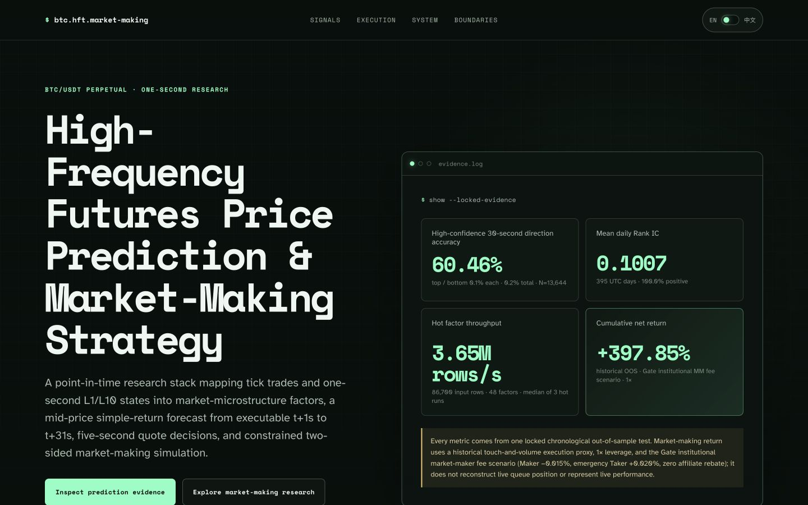

<p align="right">
  <strong>English-first webpage</strong> · 中文可在网页右上角即时切换
</p>

# High-Frequency Futures Price Prediction & Market-Making Strategy

An interactive BTC/USDT perpetual research showcase spanning tick trades, one-second L1/L10 states, market-microstructure factors, a 30-second execution-aware forecast, five-second quote decisions, and constrained two-sided market-making simulation.

## ▶ [CLICK TO OPEN THE INTERACTIVE RESEARCH SHOWCASE](https://chandleryao720.github.io/btc-high-frequency-trading-market-making/)

Inspect the synchronized event window, factor and model ablations, accuracy-versus-coverage curve, model-driven quote skew, post-fill price changes, risk path, market regimes, and end-to-end research architecture. The page opens in English and switches instantly to Chinese from the upper-right control.

[](https://chandleryao720.github.io/btc-high-frequency-trading-market-making/)

## Quant snapshot

Verified chronological out-of-sample historical simulation from **2025-04-01 to 2026-04-30**, constrained to **1× leverage**.

| Metric | Result | Metric | Result |
| --- | ---: | --- | ---: |
| Cumulative net return | **+397.85%** | Maximum drawdown | **1.61%** |
| 30-second high-confidence direction accuracy | **60.46%** | Mean daily time-series Rank IC | **0.1007** |
| Microstructure accuracy lift vs low-frequency context | **+9.63 pp** | Custom-objective execution-utility lift vs L2 | **+56.2%** |
| 30-second adverse-selection reduction | **8.72%** | Maximum-drawdown reduction | **26.1%** |
| Factor throughput | **3.65M rows/s** | Speedup vs Pandas | **4.43×** |

The return is net of the frozen Gate institutional market-maker fee scenario (**Maker −0.015%, emergency Taker +0.020%, zero affiliate rebate**) and includes the sequential inventory account. The direction result covers the 13,644 events in the top and bottom 0.1% of model scores—**0.2% of 6,822,116 eligible samples in total**—and must not be read as full-sample accuracy. The quote-skew comparison uses a zero-signal, inventory-controlled ablation to isolate the prediction input; its return is intentionally not presented as a benchmark.

## View locally

```bash
python3 -m http.server 8000
```

Then open `http://127.0.0.1:8000/`. The site has no framework build step and no runtime analytics.

## Evidence boundary

All public metrics load from one locked chronological out-of-sample evaluation. The market-making section uses a historical touch-and-volume execution proxy under the frozen Gate institutional market-maker fee scenario at 1× leverage; it does not model queue position, partial fills, or network latency and does not represent live trading or personal fee-tier eligibility. The zero-signal comparator holds quote controls fixed to isolate the prediction signal and is not a separately optimized production market-making strategy.
